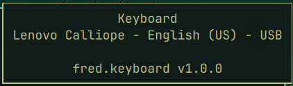
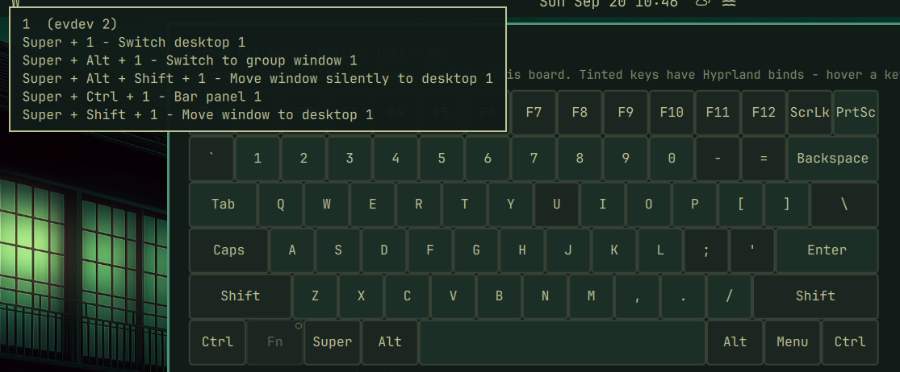
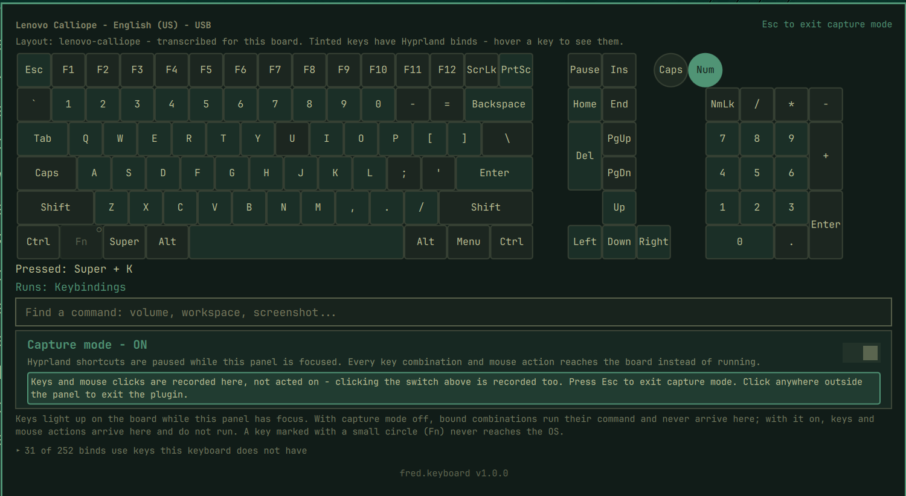
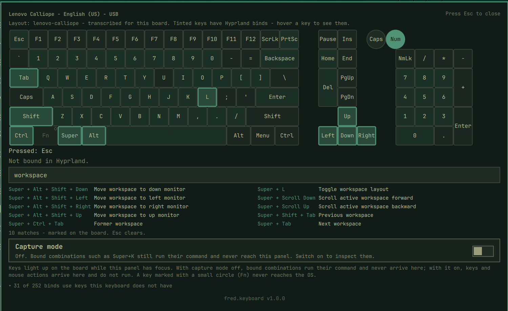

# Keyboard Shortcut Visualizer (fred.keyboard)

Fred's Omarchy keyboard plugin: a shell bar widget that shows your shortcuts on an interactive keyboard display. Press a combination to see what it runs, or search for a command to see which keys run it.


Part of Fred's `fred.*` plugin suite for Omarchy Linux (Hyprland +
Quickshell). Version 1.0.0.

## Overview

- **Hover** the bar icon: the attached keyboard's name, bus and active keymap
  ("Lenovo Calliope - English (US) - USB").

  
- **Click** it: a panel draws the board. Keys light as you press them; Caps
  and Num Lock show the real hardware LED state. Keys that have Hyprland
  binds are tinted; hover any key for its evdev code and every bind on it.

  

- **Press a chord** and the panel reads it back ("Pressed: Super + K") and
  says what it runs ("Runs: Keybindings"), or that it is not bound.
- **Capture mode** (a switch in the panel, off by default) suspends
  Hyprland's own keybind handling for the panel while it is focused, so bound
  combinations - `Super+K`, `Super`+right-click, `Super`+wheel - reach the
  board instead of firing. Press Esc to leave it.

  
- **Search** a command ("volume", "workspace", or a chord such as
  "super + k") and the matching binds are listed with their keys marked on
  the board.

  
- **Binds your keyboard cannot send** - laptop media keys inherited in a
  desktop config, F13-F24 - are listed in a collapsible section rather than
  silently dropped.
- The panel **stays open while you use apps on another monitor**, so you can
  read a bind, try it there, and come back.

## Keyboard layouts

Layouts come from two sources: the XKB geometries the OS already ships
(`pc104`, `pc105`, `jp106`, vendor boards) and a field-observed library in
`layouts/` for boards no stock geometry describes correctly. The first
entry is the Lenovo Calliope, transcribed from its keycaps: Insert on the
function row, a double-height Delete, an Fn key the OS never sees. Whether
the match is exact or a stand-in is stated on the panel. To add a board, see
[`layouts/README.md`](layouts/README.md).

## Key Event Capture

Key capture is panel-scoped: the plugin reads key events only while its own
panel holds keyboard focus, through QML key handlers. The Wayland compositor
routes keystrokes solely to the focused surface, so nothing typed in any other
window is ever visible to this plugin. It does not read `/dev/input`, does not
require `input` group membership, and runs no background process.

Capture mode is an explicit, off-by-default toggle. While it is on, the panel
holds a `zwp_keyboard_shortcuts_inhibit_manager_v1` request for its own
window, which Hyprland honours only while that window is focused. Every key
combination and mouse action then reaches the board instead of running. While
capturing, clicks inside the panel are recorded too, the switch included, so
Esc is the way out; a click anywhere outside the panel closes it. The
inhibitor releases whenever the panel loses focus, and closing the panel
always resets the mode to off.

Everything else the plugin runs goes through one closed-environment launcher
(`Launch.qml`): an absolute executable, an allowlisted environment, a
deadline, and never a shell. It reads `hyprctl devices` and `hyprctl binds`,
lists the XKB geometry directory, and opens one fixed URL (this repository)
with `xdg-open` when the version footer is clicked. Nothing is written to
disk.

## Requirements

Everything the plugin needs is part of a stock Omarchy installation; there is
nothing to install first.

- **Omarchy 4.0.4 or newer** (developed and tested on 4.0.4). The plugin is a
  standard `bar-widget` plugin using Omarchy's shell UI kit.
- **Hyprland** (tested on 0.56.2), for `hyprctl devices` and `hyprctl binds`,
  and for capture mode, which relies on the compositor implementing
  `keyboard-shortcuts-inhibit-unstable-v1`. Hyprland does; capture mode is
  the only feature that would not work on a compositor that does not.
- **Quickshell 0.3.1 or newer** with its Wayland module, as shipped with
  Omarchy, for the `ShortcutInhibitor` type.
- **`xdg-utils`** (`xdg-open`) for the footer link to this repository, and
  **`xkeyboard-config`** for the OS-supplied keyboard geometries used as
  stand-in layouts. Both are already present on Omarchy.
- A physical keyboard listed in `/proc/bus/input/devices`. A USB board is
  identified by vendor and product id; without one the panel falls back to
  a generic layout and says so.

Node.js is needed only to run the tests.

## Install

```bash
omarchy plugin add https://github.com/greenermoose/keyboard-fred-tamlinux.git --enable
```

Remove with `omarchy plugin remove fred.keyboard`.

## Upstream code

`ExplorerPanel.qml` is cloned from Omarchy's stock `Ui/KeyboardPanel.qml`
(MIT) with the other-monitor click-catchers removed, so the panel can stay
open while you work elsewhere. `UPSTREAM.md` records the version, the diff
recipe and the license notice. Nothing else is copied.

## Prior art

Eight Omarchy plugins explore adjacent ground, and this one was designed
after studying them. Credit where due, all MIT licensed:

- [`dai199/omarchy-visual-keybindings`](https://github.com/dai199/omarchy-visual-keybindings) - interactive keybinding explorer and editor; independently uses the same shortcut-inhibit mechanism
- [`neilerua973/omarchy-keybindings-editor`](https://github.com/neilerua973/omarchy-keybindings-editor) - on-screen keyboard binding editor
- [`felixzsh/omarchy-key-visualizer`](https://github.com/felixzsh/omarchy-key-visualizer) - on-screen key display for screencasts
- [`seth-wood/keyarchy`](https://github.com/seth-wood/keyarchy) - tracks which shortcuts you actually use
- [`fze-fze/omarchy-shortcut-sheet`](https://github.com/fze-fze/omarchy-shortcut-sheet) - tap-Super shortcut overlay
- [`YonatanBaum/omarchy-app-shortcuts`](https://github.com/YonatanBaum/omarchy-app-shortcuts) - per-application cheat sheet
- [`balazsorban44/omarchy-keyboard-minimap`](https://github.com/balazsorban44/omarchy-keyboard-minimap) - keyboard minimap with global capture via `/dev/input`, the approach this plugin deliberately does not take
- [`balazsorban44/omarchy-keybinding-coach`](https://github.com/balazsorban44/omarchy-keybinding-coach) - one binding at a time in the bar

No code from these projects is used here; `UPSTREAM.md` records what each
one contributed to the design. `fred.keyboard` differs mainly in drawing the
real board from layout data rather than a hardcoded grid, covering the full
key set including keys the board does not have, reporting the keyboard's
identity, and treating capture mode as a deliberate, visible toggle.

## Development

Tests run with Node and need nothing else:

```bash
for t in tests/*.test.js; do node "$t"; done
```

AI-assisted engineering is disclosed in [`AI_PROVENANCE.md`](AI_PROVENANCE.md)
and the per-session records under `docs/ai/`.

## License

GPL-3.0-or-later. See [LICENSE](LICENSE).
