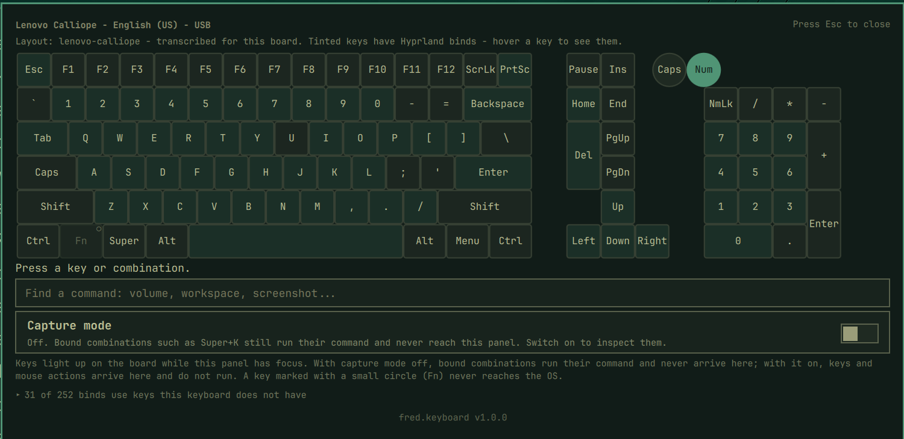

# fred.keyboard

An Omarchy shell plugin that shows your keyboard shortcuts on a model of your
actual keyboard. Press a key combination to see which command it runs, or
search for a command to see which keys trigger it.



Part of Fred's `fred.*` plugin suite. Status: in development (0.1.0).

## Install

```bash
omarchy plugin add https://github.com/greenermoose/omarchy-fred-keyboard.git --enable
```

## What it does

1. **Hover** the bar icon for the attached keyboard's type, layout and
   connection.
2. **Click** to open a panel showing a model of the keyboard. Keys light up as
   you press them, and each key shows the keycode it generates and the command
   it is bound to.
3. **Look up in both directions** - press a combination to find its command, or
   search a command to find its combination.

## Not a keylogger

Key capture is panel-scoped: the plugin reads key events only while its own
panel holds keyboard focus, using QML key handlers. The Wayland compositor
routes keystrokes solely to the focused surface, so nothing typed in any other
window is ever visible to this plugin. It does not read `/dev/input`, does not
require `input` group membership, and runs no background process.

"Capture mode" is an explicit, off-by-default toggle. While it is on, the
plugin uses `zwp_keyboard_shortcuts_inhibit_manager_v1` to suspend Hyprland's
keybind matching, so pressing a bound combination lights it on the board,
names the chord and says what it runs instead of running it. Mouse clicks and
wheel steps are captured the same way. Turn it off with Escape; closing the
panel always resets it to off, and the inhibitor releases whenever the panel
loses focus.

## Upstream code

`ExplorerPanel.qml` is cloned from Omarchy's stock `Ui/KeyboardPanel.qml`
(MIT) with the other-monitor click-catchers removed, so the panel can stay
open while you work elsewhere. `UPSTREAM.md` records the version, the diff
recipe and the license notice.

## Prior art

Several Omarchy plugins explore adjacent ground, and this one was designed
after studying them. Credit where due, all MIT licensed:

- [`dai199/omarchy-visual-keybindings`](https://github.com/dai199/omarchy-visual-keybindings) - interactive keybinding explorer and editor
- [`neilerua973/omarchy-keybindings-editor`](https://github.com/neilerua973/omarchy-keybindings-editor) - on-screen keyboard binding editor
- [`felixzsh/omarchy-key-visualizer`](https://github.com/felixzsh/omarchy-key-visualizer) - on-screen key display for screencasts
- [`seth-wood/keyarchy`](https://github.com/seth-wood/keyarchy) - tracks which shortcuts you actually use
- [`fze-fze/omarchy-shortcut-sheet`](https://github.com/fze-fze/omarchy-shortcut-sheet) - tap-Super shortcut overlay
- [`YonatanBaum/omarchy-app-shortcuts`](https://github.com/YonatanBaum/omarchy-app-shortcuts) - per-application cheat sheet

No code from these projects is used here. `fred.keyboard` differs mainly in
driving its keyboard model from XKB geometry data rather than a hardcoded
grid, covering the full key set including media keys, and treating capture
mode as a deliberate toggle.

## License

GPL-3.0-or-later. See [LICENSE](LICENSE).
